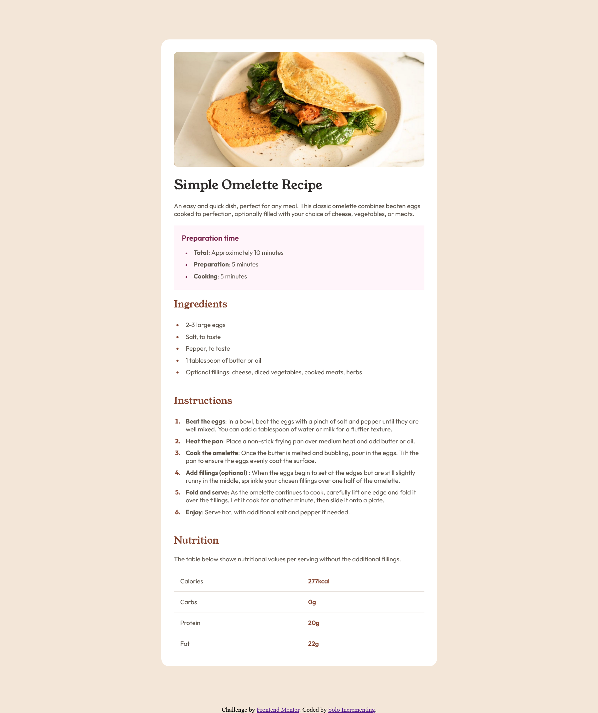

# Frontend Mentor - Recipe page solution

This is a solution to the [Recipe page challenge on Frontend Mentor](https://www.frontendmentor.io/challenges/recipe-page-KiTsR8QQKm). Frontend Mentor challenges help you improve your coding skills by building realistic projects.

## Table of contents

- [Overview](#overview)
  - [Result](#result)
  - [Links](#links)
- [My process](#my-process)
  - [Workflow](#workflow)
  - [Built with](#built-with)
  - [What I learned](#what-i-learned)
  - [Continued development](#continued-development)
- [Author](#author)

## Overview

### Result



### Links

- Solution URL: [https://solo-incrementing.github.io/recipe-page/](FrontendMentor)
- Live Site URL: [https://solo-incrementing.github.io/recipe-page/](Live)

## My process

### Workflow

- Write HTML first to create the structure that will be built upon.
- Style from lowest specificity to highest specficity of elements.
- Style structures such as flexboxes and grids.
- Compare with the initial design to locate discrepancies and resolve them.

### Built with

- Semantic HTML5 markup
- CSS custom properties
- Desktop-first workflow

### What I learned

You can implement a separator line between table row elements using a bottom border on the table rows and marking the border-collapse property for the table to collapse to ensure the border can be seen.

```css
table {
	width: 100%;
	border-collapse: collapse;
}

tr {
	border-bottom: 1px solid var(--primary-accent-color);
}
```

### Continued development

I want to utilise the BEM convention for writing css classes in slightly larger projects

## Author

- Frontend Mentor - [@Solo-Incrementing](https://www.frontendmentor.io/profile/Solo-Incrementing)
- Github - [@Solo-Incrementing](https://github.com/Solo-Incrementing)
